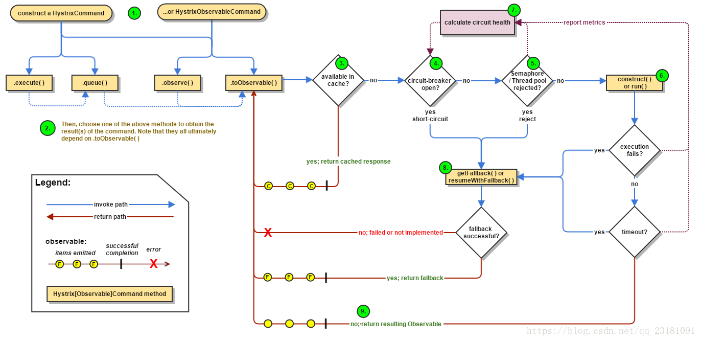

##Hystrix是Netflix开源的一个限流熔断的项目、主要有以下功能:
隔离（线程池隔离和信号量隔离）：限制调用分布式服务的资源使用，某一个调用的服务出现问题不会影响其他服务调用。
优雅的降级机制：超时降级、资源不足时(线程或信号量)降级，降级后可以配合降级接口返回托底数据。
融断：当失败率达到阀值自动触发降级(如因网络故障/超时造成的失败率高)，熔断器触发的快速失败会进行快速恢复。
缓存：提供了请求缓存、请求合并实现。支持实时监控、报警、控制（修改配置）
##下面是他的工作流程:

Hystrix主要有4种调用方式：
toObservable() 方法 ：未做订阅，只是返回一个Observable 。
observe() 方法 ：调用 #toObservable() 方法，并向 Observable 注册 rx.subjects.ReplaySubject 发起订阅。
queue() 方法 ：调用 #toObservable() 方法的基础上，调用：Observable#toBlocking() 和 BlockingObservable#toFuture() 返回 Future 对象
execute() 方法 ：调用 #queue() 方法的基础上，调用 Future#get() 方法，同步返回 #run() 的执行结果。
主要的执行逻辑：
1.每次调用创建一个新的HystrixCommand,把依赖调用封装在run()方法中.

2.执行execute()/queue做同步或异步调用.

3.判断熔断器(circuit-breaker)是否打开,如果打开跳到步骤8,进行降级策略,如果关闭进入步骤.

4.判断线程池/队列/信号量是否跑满，如果跑满进入降级步骤8,否则继续后续步骤.

5.调用HystrixCommand的run方法.运行依赖逻辑

依赖逻辑调用超时,进入步骤8.

6.判断逻辑是否调用成功。返回成功调用结果；调用出错，进入步骤8.

7.计算熔断器状态,所有的运行状态(成功, 失败, 拒绝,超时)上报给熔断器，用于统计从而判断熔断器状态.

8.getFallback()降级逻辑。以下四种情况将触发getFallback调用：

run()方法抛出非HystrixBadRequestException异常。
run()方法调用超时
熔断器开启拦截调用
线程池/队列/信号量是否跑满
没有实现getFallback的Command将直接抛出异常，fallback降级逻辑调用成功直接返回，降级逻辑调用失败抛出异常.
9.返回执行成功结果
