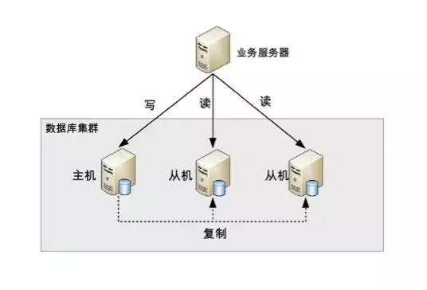

因为用户的增多，数据的增多，单机的数据库往往支撑不住快速发展的业务，所以数据库集群就产生了！今天来说说读写分离的数据库集群方式！ 读写分离顾名思义就是读和写分离了，对应到数据库集群一般都是一主一从(一个主库，一个从库)或者一主多从(一个主库，多个从库)，业务服务器把需要写的操作都写到主数据库中，读的操作都去从库查询。主库会同步数据到从库保证数据的一致性。

（1）如何实现mysql的读写分离？
其实很简单，就是基于主从复制架构，简单来说，就搞一个主库，挂多个从库，然后我们就单单只是写主库，然后主库会自动把数据给同步到从库上去。 