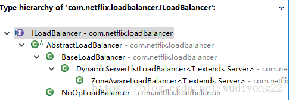

Load Balance负载均衡是用于解决一台机器(一个进程)无法解决所有请求而产生的一种算法。像nginx可以使用负载均衡分配流量，ribbon为客户端提供负载均衡，dubbo服务调用里的负载均衡等等，很多地方都使用到了负载均衡。

使用负载均衡带来的好处很明显：

当集群里的1台或者多台服务器down的时候，剩余的没有down的服务器可以保证服务的继续使用
使用了更多的机器保证了机器的良性使用，不会由于某一高峰时刻导致系统cpu急剧上升
负载均衡有好几种实现策略，常见的有：
|策略名|策略对应的类名|实现原理|
|-|-|-|
|轮询策略（默认）|RoundRobinRule|轮询策略表示每次都顺序取下一个 provider，比如一共有 5 个provider，第 1 次取第 1 个，第 2次取第 2 个，第 3 次取第 3 个，以此类推|
|权重轮询策略|WeightedResponseTimeRule|1.根据每个 provider 的响应时间分配一个权重，响应时间越长，权重越小，被选中的可能性越低。2.原理：一开始为轮询策略，并开启一个计时器，每 30 秒收集一次每个 provider 的平均响应时间，当信息足够时，给每个 provider附上一个权重，并按权重随机选择provider，高权越重的 provider会被高概率选中。|
|随机策略|RandomRule|RandomRule|
|最少并发数策略|BestAvailableRule|选择正在请求中的并发数最小的 provider，除非这个provider 在熔断中。|
|在“选定的负载均衡策略”基础上进行重试机制|RetryRule|1.“选定的负载均衡策略”这个策略是轮询策略RoundRobinRule2.该重试策略先设定一个阈值时间段，如果在这个阈值时间段内当选择 provider 不成功，则一直尝试采用“选定的负载均衡策略：轮询策略”最后选择一个可用的provider|
|可用性敏感策略|AvailabilityFilteringRule|过滤性能差的 provider,有 2种：第一种：过滤掉在 eureka 中处于一直连接失败 provider 第二种：过滤掉高并发的 provider|
|区域敏感性策略|ZoneAvoidanceRule|1.以一个区域为单位考察可用性，对于不可用的区域整个丢弃，从剩下区域中选可用的provider2.如果这个 ip 区域内有一个或多个实例不可达或响应变慢，都会降低该 ip 区域内其他 ip 被选中的权重。|

ILoadBalance 负载均衡器
ribbon是一个为客户端提供负载均衡功能的服务，它内部提供了一个叫做ILoadBalance的接口代表负载均衡器的操作，比如有添加服务器操作、选择服务器操作、获取所有的服务器列表、获取可用的服务器列表等等。ILoadBalance的继承关系如下：
