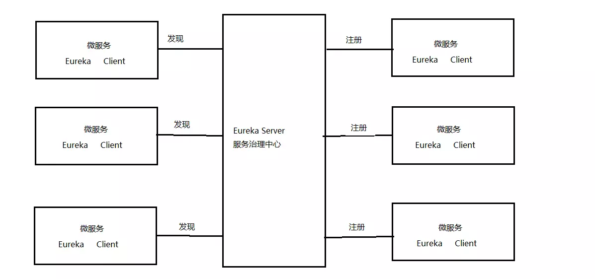

	eureka负责服务注册和服务发现，为了高可用，一般需要多个eureka server相互注册，组成集群。Eureka Server的同步遵循着一个非常简单的原则：只要有一条边将节点连接，就可以进行信息传播与同步。
	eureka内部对于注册的service主要通过心跳来监控service是否已经挂掉，默认心跳时间是15s。这就意味着，当一个服务提供方挂掉以后，服务订阅者最长可能30s以后才发现。
	service启动连上eureka之后，会同步一份服务列表到本地缓存，服务注册有更新时，eureka会推送到每个service。
	eureka也会有一些策略防止由于某个服务所在网络的不稳定导致的所有服务心跳停止的雪崩现象。
	eureka自带web页面，在页面上能看到所有的服务注册情况 和 eureka集群状态。
	eureka支持服务自己主动下掉自己，请求service的下列地址，可以让服务从eureka上下掉自己，同时service进程也会自己停掉自己。
curl -H 'Accept:application/json' -X POST localhost:${management.port}/shutdown

# 1 Eureka注册中心
## 1.1 需求分析
在前后端分离架构中，服务层被拆分成了很多的微服务，微服务的信息如何管理？Spring Cloud中提供服务注册中心来管理微服务信息。

#### 为什么 要用注册中心？

1、微服务数量众多，要进行远程调用就需要知道服务端的ip地址和端口，注册中心帮助我们管理这些服务的ip和端口。

2、微服务会实时上报自己的状态，注册中心统一管理这些微服务的状态，将存在问题的服务踢出服务列表，客户端获取到可用的服务进行调用。

## 1.3 Eureka注册中心
### 1.3.1 Eureka介绍
Spring Cloud Eureka 是对Netflix公司的Eureka的二次封装，它实现了服务治理的功能，Spring Cloud Eureka提
供服务端与客户端，服务端即是Eureka服务注册中心，客户端完成微服务向Eureka服务的注册与发现。服务端和客户端均采用Java语言编写。下图显示了Eureka Server与Eureka Client的关系：

1、Eureka Server是服务端，负责管理各各微服务结点的信息和状态。
2、在微服务上部署Eureka Client程序，远程访问Eureka Server将自己注册在Eureka Server。
3、微服务需要调用另一个微服务时从Eureka Server中获取服务调用地址，进行远程调用。

1.3.2 Eureka Server搭建
1、创建xc-govern-center工程：
包结构：com.xuecheng.govern.center
2、添加依赖
在父工程添加：
      ```            <dependency>
                <groupId>org.springframework.cloud</groupId>
                <artifactId>spring-cloud-dependencies</artifactId>
                <version>Finchley.SR1</version>
                <type>pom</type>
                <scope>import</scope>
            </dependency>

```
