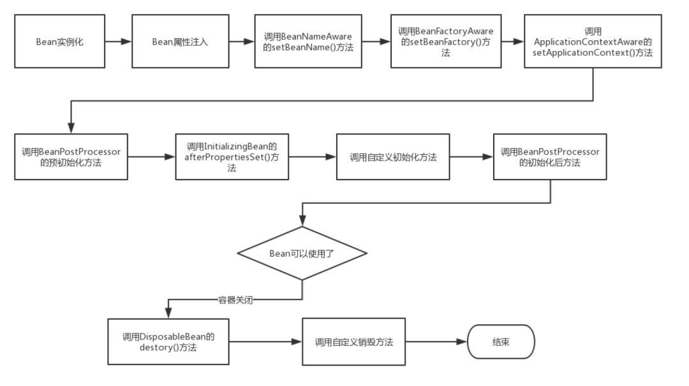

在传统的Java应用中，bean的生命周期很简单，使用Java关键字 new 进行Bean 的实例化，然后该Bean 就能够使用了。一旦bean不再被使用，则由Java自动进行垃圾回收。

相比之下，Spring管理Bean的生命周期就复杂多了，正确理解Bean 的生命周期非常重要，因为Spring对Bean的管理可扩展性非常强，下面展示了一个Bean的构造过程

Bean 的生命周期

如上图所示，Bean 的生命周期还是比较复杂的，下面来对上图每一个步骤做文字描述:

Spring启动，查找并加载需要被Spring管理的bean，进行Bean的实例化

Bean实例化后对将Bean的引入和值注入到Bean的属性中

如果Bean实现了BeanNameAware接口的话，Spring将Bean的Id传递给setBeanName()方法

如果Bean实现了BeanFactoryAware接口的话，Spring将调用setBeanFactory()方法，将BeanFactory容器实例传入

如果Bean实现了ApplicationContextAware接口的话，Spring将调用Bean的setApplicationContext()方法，将bean所在应用上下文引用传入进来。

如果Bean实现了BeanPostProcessor接口，Spring就将调用他们的postProcessBeforeInitialization()方法。

如果Bean 实现了InitializingBean接口，Spring将调用他们的afterPropertiesSet()方法。类似的，如果bean使用init-method声明了初始化方法，该方法也会被调用

如果Bean 实现了BeanPostProcessor接口，Spring就将调用他们的postProcessAfterInitialization()方法。

此时，Bean已经准备就绪，可以被应用程序使用了。他们将一直驻留在应用上下文中，直到应用上下文被销毁。

如果bean实现了DisposableBean接口，Spring将调用它的destory()接口方法，同样，如果bean使用了destory-method 声明销毁方法，该方法也会被调用。
**上面是Spring 中Bean的核心接口和生命周期，面试回答上述过程已经足够了。但是翻阅JavaDoc文档发现除了以上接口外，还有另外的初始化过程涉及的接口：

摘自org.springframework.beans.factory.BeanFactory， 全部相关接口如下，上述已有的就不用着重标注，把额外的相关接口着重标注下**