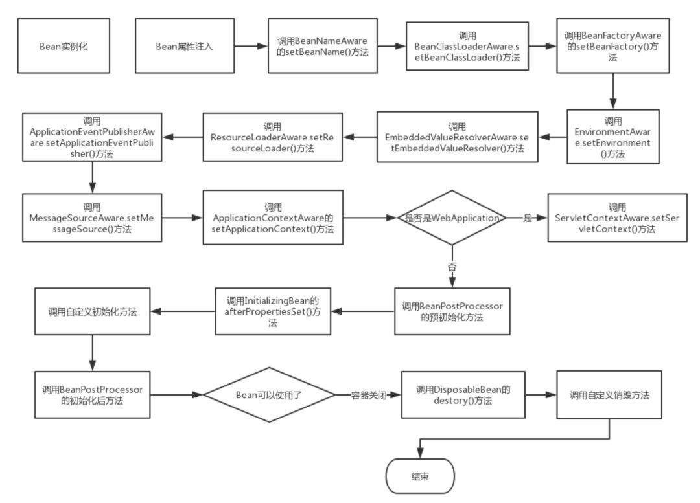

在传统的Java应用中，bean的生命周期很简单，使用Java关键字 new 进行Bean 的实例化，然后该Bean 就能够使用了。一旦bean不再被使用，则由Java自动进行垃圾回收。

相比之下，Spring管理Bean的生命周期就复杂多了，正确理解Bean 的生命周期非常重要，因为Spring对Bean的管理可扩展性非常强，下面展示了一个Bean的构造过程

Bean 的生命周期

如上图所示，Bean 的生命周期还是比较复杂的，下面来对上图每一个步骤做文字描述:

Spring启动，查找并加载需要被Spring管理的bean，进行Bean的实例化

Bean实例化后对将Bean的引入和值注入到Bean的属性中

如果Bean实现了BeanNameAware接口的话，Spring将Bean的Id传递给setBeanName()方法

如果Bean实现了BeanFactoryAware接口的话，Spring将调用setBeanFactory()方法，将BeanFactory容器实例传入

如果Bean实现了ApplicationContextAware接口的话，Spring将调用Bean的setApplicationContext()方法，将bean所在应用上下文引用传入进来。

如果Bean实现了BeanPostProcessor接口，Spring就将调用他们的postProcessBeforeInitialization()方法。

如果Bean 实现了InitializingBean接口，Spring将调用他们的afterPropertiesSet()方法。类似的，如果bean使用init-method声明了初始化方法，该方法也会被调用

如果Bean 实现了BeanPostProcessor接口，Spring就将调用他们的postProcessAfterInitialization()方法。

此时，Bean已经准备就绪，可以被应用程序使用了。他们将一直驻留在应用上下文中，直到应用上下文被销毁。

如果bean实现了DisposableBean接口，Spring将调用它的destory()接口方法，同样，如果bean使用了destory-method 声明销毁方法，该方法也会被调用。

**上面是Spring 中Bean的核心接口和生命周期，面试回答上述过程已经足够了。但是翻阅JavaDoc文档发现除了以上接口外，还有另外的初始化过程涉及的接口：**

**摘自org.springframework.beans.factory.BeanFactory， 全部相关接口如下，上述已有的就不用着重标注，把额外的相关接口着重标注下**

Bean 完整的生命周期

文字解释如下：

————————————初始化————————————

BeanNameAware.setBeanName() 在创建此bean的bean工厂中设置bean的名称，在普通属性设置之后调用，在InitializinngBean.afterPropertiesSet()方法之前调用

BeanClassLoaderAware.setBeanClassLoader(): 在普通属性设置之后，InitializingBean.afterPropertiesSet()之前调用

BeanFactoryAware.setBeanFactory() : 回调提供了自己的bean实例工厂，在普通属性设置之后，在InitializingBean.afterPropertiesSet()或者自定义初始化方法之前调用

EnvironmentAware.setEnvironment(): 设置environment在组件使用时调用

EmbeddedValueResolverAware.setEmbeddedValueResolver(): 设置StringValueResolver 用来解决嵌入式的值域问题

ResourceLoaderAware.setResourceLoader(): 在普通bean对象之后调用，在afterPropertiesSet 或者自定义的init-method 之前调用，在 ApplicationContextAware 之前调用。

ApplicationEventPublisherAware.setApplicationEventPublisher(): 在普通bean属性之后调用，在初始化调用afterPropertiesSet 或者自定义初始化方法之前调用。在 ApplicationContextAware 之前调用。

MessageSourceAware.setMessageSource(): 在普通bean属性之后调用，在初始化调用afterPropertiesSet 或者自定义初始化方法之前调用，在 ApplicationContextAware 之前调用。

ApplicationContextAware.setApplicationContext(): 在普通Bean对象生成之后调用，在InitializingBean.afterPropertiesSet之前调用或者用户自定义初始化方法之前。在ResourceLoaderAware.setResourceLoader，ApplicationEventPublisherAware.setApplicationEventPublisher，MessageSourceAware之后调用。

ServletContextAware.setServletContext(): 运行时设置ServletContext，在普通bean初始化后调用，在InitializingBean.afterPropertiesSet之前调用，在 ApplicationContextAware 之后调用注：是在WebApplicationContext 运行时

BeanPostProcessor.postProcessBeforeInitialization() : 将此BeanPostProcessor 应用于给定的新bean实例 在任何bean初始化回调方法(像是InitializingBean.afterPropertiesSet或者自定义的初始化方法）之前调用。这个bean将要准备填充属性的值。返回的bean示例可能被普通对象包装，默认实现返回是一个bean。

BeanPostProcessor.postProcessAfterInitialization() : 将此BeanPostProcessor 应用于给定的新bean实例 在任何bean初始化回调方法(像是InitializingBean.afterPropertiesSet或者自定义的初始化方法)之后调用。这个bean将要准备填充属性的值。返回的bean示例可能被普通对象包装

InitializingBean.afterPropertiesSet(): 被BeanFactory在设置所有bean属性之后调用(并且满足BeanFactory 和 ApplicationContextAware)。

————————————销毁————————————

在BeanFactory 关闭的时候，Bean的生命周期会调用如下方法:

DestructionAwareBeanPostProcessor.postProcessBeforeDestruction(): 在销毁之前将此BeanPostProcessor 应用于给定的bean实例。能够调用自定义回调，像是DisposableBean 的销毁和自定义销毁方法，这个回调仅仅适用于工厂中的单例bean(包括内部bean)

实现了自定义的destory()方法

