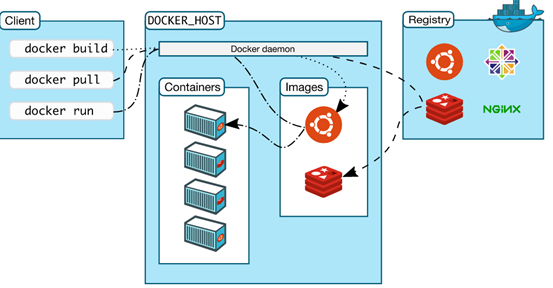

Docker 的核心组件包括：
  1. Docker Client
  2. Docker daemon
  3. Docker Image
  4. Docker Registry
  5. Docker Container

Docker 采用的是 Client/Server 架构。客户端向服务器发送请求，服务器负责构建、运行和分发容器。客户端和服务器可以运行在同一个 Host 上，客户端也可以通过 socket 或 REST API 与远程的服务器通信。可能很多朋友暂时不太理解一些东西，比如 REST API 是什么东西等，不过没关系，在后面的文章中会一一给大家讲解清楚。

## Docker Client
Docker Client ，也称 Docker 客户端。它其实就是 Docker 提供命令行界面 (CLI) 工具，是许多 Docker 用户与 Docker 进行交互的主要方式。客户端可以构建，运行和停止应用程序，还可以远程与Docker_Host进行交互。最常用的 Docker 客户端就是 docker 命令，我们可以通过 docker 命令很方便地在 host 上构建和运行 docker 容器。
## Docker daemon
Docker daemon 是服务器组件，以 Linux 后台服务的方式运行，是 Docker 最核心的后台进程，我们也把它称为守护进程。它负责响应来自 Docker Client 的请求，然后将这些请求翻译成系统调用完成容器管理操作。该进程会在后台启动一个 API Server ，负责接收由 Docker Client 发送的请求，接收到的请求将通过Docker daemon 内部的一个路由分发调度，由具体的函数来执行请求。
Docker Daemon 可以认为是通过 Docker Server 模块接受 Docker Client 的请求，并在 Engine 中处理请求，然后根据请求类型，创建出指定的 Job 并运行。 Docker Daemon 运行在 Docker host 上，负责创建、运行、监控容器，构建、存储镜像。
## Docker 镜像
Docker 镜像可以看作是一个特殊的文件系统，除了提供容器运行时所需的程序、库、资源、配置等文件外，还包含了一些为运行时准备的一些配置参数（如匿名卷、环境变量、用户等）。镜像不包含任何动态数据，其内容在构建之后也不会被改变。我们可将 Docker 镜像看成只读模板，通过它可以创建 Docker 容器
镜像有多种生成方法：
6.	从无到有开始创建镜像
7.	下载并使用别人创建好的现成的镜像
8.	在现有镜像上创建新的镜像
特性	容器	虚拟机
启动	秒级	分钟级
硬盘使用	一般为MB	一般为GB
性能	接近原生	弱于
系统支持量	单机支持上千个容器	一般是几十个

# 一.安装docker【centos7】
1. 查看当前内核版本  要求centos的内核版本大于3.10
 uname -r
2. 更新yum包到最新
yum -y update
3. 卸载旧版本
yum remove docker docker-common docker-selinux docker-engine
4. 安装需要的软件包
 yum install -y yum-utils device-mapper-persistent-data lvm2
5. 设置yum源
yum-config-manager --add-repo https://download.docker.com/linux/centos/docker-ce.repo
6. 存储库中列出可用版本 
yum list docker-ce --showduplicates | sort -r
7. 安装docker  安装特定版本
yum install docker-ce    #安装最新稳定版
或yum install docker-ce-<VERSION_STRING> docker-ce-cli-<VERSION_STRING> containerd.io
8. 启动并加入开机自启
   systemctl start docker
   systemctl enable docker
9. 安装是否成功
docker version

# 二.配置镜像加速器
1.cd  /etc/docker
  查看有没有daemon.json,这是docker的默认配置文件，修改该文件   如果没有则新建 touch daemon.json
{   "registry-mirrors": ["https://dockerhub.azk8s.cn",
                       "https://reg-mirror.qiniu.com"]  }

docker---设置镜像加速器
    国内从 Docker Hub 拉取镜像有时会遇到困难，此时可以配置镜像加速器，国内很多云服务商都提供了国内加速器服务，如：
Azure 中国镜像：https://dockerhub.azk8s.cn
阿里云加速器（需登录帐号获取）
七牛云加速器：https://reg-mirror.qiniu.com
2.重启docker

#  三.docker常用命令
       镜像相关指令
1. 搜索镜像
    docker search java
2. 下载镜像
    docker pull java:8
3. 列出镜像  查看已下载的镜像
    docker images
           repostory :镜像所属仓库名称
           tag:镜像标签
           imageId:镜像id，镜像的唯一标识
           created:创建时间
           size:镜像大小
4. 删除本地镜像
 docker rmi 删除指定镜像
   docker rmi java
   容器相关指令
    1. 新建并启动容器
           docker run --name container-name -d image-name:tag
              1.  --name：自定义容器名，不指定时，docker 会自动生成一个名称
            2.  -d：表示后台运行容器
            3.image-name：指定运行的镜像名称以及 Tag 
           docker run -d -p 91:80 nginx
         91:宿主机端口号
          80：容器端口号
        2. 查看容器
    docker ps -a
        3.停止容器
使用 docker stop container-name/container-id 命令进行停止容器运行，指定容器名或者容器 id 即可
        4.启动容器
 使用 docker start container-name/container-id 命令启动停止运行的容器，
 同理可以根据 容器名 或者 容器 id 进行启动
         5.删除容器
使用 docker rm container-id 命令 删除容器，删除容器前，必须先停止容器运行，根据 容器 id 进行删除
         6.容器日志
使用 docker logs container-name/container-id 命令 可以查看容器日志信息，指定容器名或者 容器 id 即可
         7.查看容器进程
    docker top container-name/container-id
         8.查看容器所有信息
    docker inspect container-name/container-id
         9.进入到容器中
     docker exec -it 775c7c9ee1e1 /bin/bash
四.项目部署
1.打包springboot项目为jar包
2.编写Dockerfile文件
 
# 基础镜像使用java
FROM java:8 # VOLUME 指定了临时文件目录为/tmp。 # 其效果是在主机 /var/lib/docker 目录下创建了一个临时文件，并链接到容器的/tmp VOLUME /tmp  # 将jar包添加到容器中并更名为app.jar ADD ROOT.jar app.jar  # 运行jar包 RUN bash -c 'touch /app.jar' ENTRYPOINT ["java","-Djava.security.egd=file:/dev/./urandom","-jar","/app.jar"]

   解释下这个配置文件：
VOLUME: 指定了临时文件目录为/tmp。其效果是在主机 /var/lib/docker 目录下创建了一个临时文件，并链接到容器的/tmp。改步骤是可选的，如果涉及到文件系统的应用就很有必要了。/tmp目录用来持久化到 Docker 数据文件夹，因为 Spring Boot 使用的内嵌 Tomcat 容器默认使用/tmp作为工作目录
项目的 jar 文件作为 “app.jar” 添加到容器的
ENTRYPOINT 执行项目 app.jar。为了缩短 Tomcat 启动时间，添加一个系统属性指向 “/dev/./urandom” 作为 Entropy Source
如果是第一次打包，它会自动下载java 8的镜像作为基础镜像，以后再制作镜像的时候就不会再下载了。
3. 部署文件
   maven打包好的jar包和Dockerfile文件复制到服务器的同一目录下
 
4.制作镜像
     执行下面命令， 看好，最后面有个"."点！    -t 参数是指定此镜像的tag名
      docker build -t eureka-server .
5.查看镜像是否制作成功
docker images
 
   6.启动容器
   docker run -d -p 8006:8006 eureka-server
   7.访问页面
   http://192.168.73.131:8006/
四.项目部署(需要连接mysql)
1.安装mysql
a.下载mysql镜像 
         docker pull mysql:5.7 
b.创建数据挂载点（即存储数据的地方，这样即便mysql容器删除了，数据还是在）
 		docker volume create mysql_data 
c.运行mysql容器
   docker run --name mysql -p 3306:3306 -v mysql_data:/var/lib/mysql -e  MYSQL_ROOT_PASSWORD=123456 -d mysql:5.7
  解释：
--name 镜像名称 
-p映射端口 
-v /mysql/datadir:/var/lib/mysql 设置本地挂载点
-e MYSQL_ROOT_PASSWORD=123456 设置密码
-d mysql 容器名称

d. 进入容器 /bin/bash
        docker exec -it mysql bash
f. 进入mysql
         mysql -uroot -p123456
g.mysql授权
   GRANT ALL PRIVILEGES ON *.* TO 'root'@'%'WITH GRANT OPTION;
h.刷新
   FLUSH PRIVILEGES;

2.运行项目
 同上 把自己的项目打成jar包  创建一个product-server镜像,然后运行
docker run -it --net=host --name product-server -p 8181:8181 product-server
注意：注意一定要使用host网络连接方式，否则项目会连接不上mysql，导致项目起不来。
