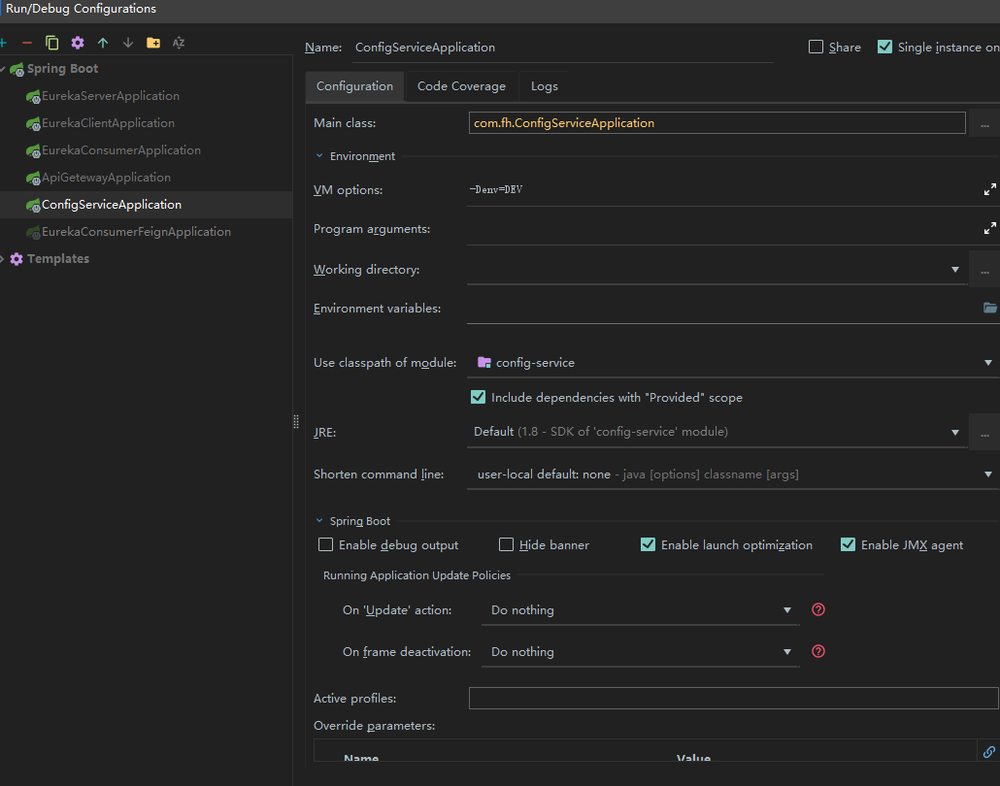
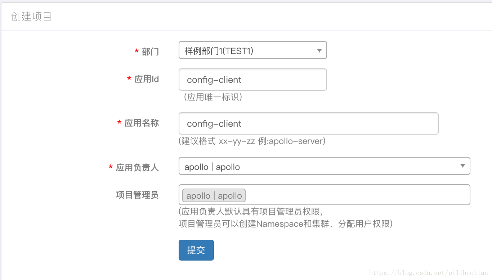
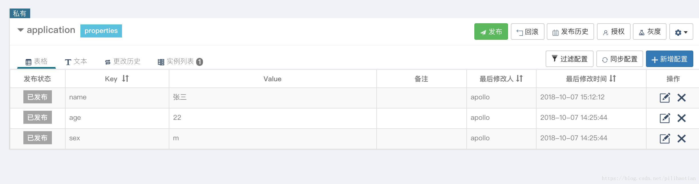

````
<dependency>
 
    <groupId>com.ctrip.framework.apollo</groupId>
 
    <artifactId>apollo-core</artifactId>
 
    <version>RELEASE/version>
 
</dependency>
````

Apollo客户端依赖于AppId，Apollo Meta Server等环境信息来工作，所以请确保下面的配置正确：
**1、 AppId**
AppId是应用的身份信息，是配置中心的一个项目id，一般和应用名称保持一致，是从服务端获取配置的一个重要信息。

有以下3种方式设置，按照优先级从高到底分别为：

1、System Property

   通过System Property传入app.id信息，如：-Dapp.id=YOUR-APP-ID

2、Spring Boot application.properties（本案例使用的方式）

通过Spring Boot的application.properties文件配置，如：app.id=YOUR-APP-ID

3、app.properties

确保classpath:/META-INF/app.properties文件存在，并且其中内容形如：app.id=YOUR-APP-ID

**2、Apollo Meta Server**
Apollo支持应用在不同的环境有不同的配置，所以需要在运行提供给Apollo客户端当前环境信息。默认情况下，meta server和config service是部署在同一个JVM进程，所以meta server的地址就是config service的地址。

支持以下方式配置apollo meta server信息，按照优先级从高到底分别为：

1、通过Java System Property apollo.meta

可以通过Java的System Property apollo.meta来指定

启动脚本中，格式为： -Dapollo.meta=http://config-service-url

运行jar文件，格式为：java -Dapollo.meta=http://config-service-url -jar xxx.jar

程序指定，如System.setProperty("apollo.meta", "http://config-service-url");

2、通过Spring Boot的配置文件（本案例使用的方式）

可以在Spring Boot的application.properties或bootstrap.properties中指定apollo.meta=http://config-service-url

3、通过操作系统的System Environment  APOLLO_META

可以通过操作系统的System Environment  APOLLO_META来指定，key为全大写，且中间是_分隔

4、通过server.properties配置文件

可以在server.properties配置文件中指定apollo.meta=http://config-service-url

对于Mac/Linux，文件位置为/opt/settings/server.properties

对于Windows，文件位置为C:\opt\settings\server.properties

5、通过app.properties配置文件

可以在classpath:/META-INF/app.properties指定apollo.meta=http://config-service-url

6、通过Java system property  ${env}_meta

7、如果当前env是dev，那么用户可以配置-Ddev_meta=http://config-service-url

8、通过apollo-env.properties文件

用户也可以创建一个apollo-env.properties，放在程序的classpath下，或者放在spring boot应用的config目录下
``
dev.meta=http://1.1.1.1:8080
fat.meta=http://apollo.fat.xxx.com
uat.meta=http://apollo.uat.xxx.com
pro.meta=http://apollo.xxx.com
``
++如果通过以上各种手段都无法获取到Meta Server地址，Apollo最终会fallback到http://apollo.meta作为Meta Server地址++

**3、 本地缓存路径**
Apollo客户端会把从服务端获取到的配置在本地文件系统缓存一份，用于在遇到服务不可用，或网络不通的时候，依然能从本地恢复配置，不影响应用正常运行。

本地缓存路径默认位于以下路径，所以请确保/opt/data或C:\opt\data\目录存在，且应用有读写权限。
- Mac/Linux: /opt/data/{appId}/config-cache
- Windows: C:\opt\data\{appId}\config-cache
本地配置文件会以下面的文件名格式放置于本地缓存路径下：

***{appId}+{cluster}+{namespace}.properties***

- appId就是应用自己的appId，如100004458
- cluster就是应用使用的集群，一般在本地模式下没有做过配置的话，就是default
- namespace就是应用使用的配置namespace，默认是application 

文件内容以properties格式存储，key:value。

# 4、自定义缓存路径
Apollo 1.0.0版本开始支持以下方式自定义缓存路径，按照优先级从高到底分别为：
1. 通过Java System Property apollo.cacheDir
   1. 可以通过Java的System Property apollo.cacheDir来指定
   2. 在Java程序启动脚本中，可以指定-Dapollo.cacheDir=/opt/data/some-cache-dir
       1. 如果是运行jar文件，需要注意格式是java -
 Dapollo.cacheDir=/opt/data/some-cache-dir -jar xxx.jar
   3. 也可以通过程序指定，如System.setProperty("apollo.cacheDir", "/opt/data/some-cache-dir");
2. 通过Spring Boot的配置文件
   1. 可以在Spring Boot的application.properties或bootstrap.properties中指定apollo.cacheDir=/opt/data/some-cache-dir
3. 通过操作系统的System Environment APOLLO_CACHEDIR
   1. 可以通过操作系统的System Environment APOLLO_CACHEDIR来指定
   2. 注意key为全大写，且中间是_分隔
4. 通过server.properties配置文件
   1. 可以在server.properties配置文件中指定apollo.cacheDir=/opt/data/some-cache-dir
   2. 对于Mac/Linux，文件位置为/opt/settings/server.properties
   3. 对于Windows，文件位置为C:\opt\settings\server.properties
- 注：本地缓存路径也可用于容灾目录，如果应用在所有config service都挂掉的情况下需要扩容，那么也可以先把配置从已有机器上的缓存路径复制到新机器上的相同缓存路径。

**5、 Environment**
Environment可以通过以下3种方式的任意一个配置：

1. 通过Java System Property
   1. 可以通过Java的System Property env来指定环境
   2. 在Java程序启动脚本中，可以指定-Denv=YOUR-ENVIRONMENT
      1. 如果是运行jar文件，需要注意格式是java -Denv=YOUR-ENVIRONMENT -jar xxx.jar
   3. 注意key为全小写
2. 通过操作系统的System Environment
   1. 还可以通过操作系统的System Environment ENV来指定
   2. 注意key为全大写

3. 通过配置文件
   1. 最后一个推荐的方式是通过配置文件来指定env=YOUR-ENVIRONMENT
   2. 对于Mac/Linux，文件位置为/opt/settings/server.properties
   3. 对于Windows，文件位置为C:\opt\settings\server.properties
   
文件内容形如：env=DEV

目前，env支持以下几个值（大小写不敏感）：
- DEV
- FAT
- UAT
- PRO

6、实战
启动Eureka服务
1. 创建springBoot项目，项目名为：config-service
2. 引入apollo client依赖，pom如下

````
<?xml version="1.0" encoding="UTF-8"?>
<project xmlns="http://maven.apache.org/POM/4.0.0" xmlns:xsi="http://www.w3.org/2001/XMLSchema-instance"
         xsi:schemaLocation="http://maven.apache.org/POM/4.0.0 http://maven.apache.org/xsd/maven-4.0.0.xsd">
    <modelVersion>4.0.0</modelVersion>

    <groupId>com.example</groupId>
    <artifactId>config-client</artifactId>
    <version>0.0.1-SNAPSHOT</version>
    <packaging>jar</packaging>
 
    <name>config-client</name>
    <description>Demo project for Spring Boot</description>
 
    <parent>
        <groupId>org.springframework.boot</groupId>
        <artifactId>spring-boot-starter-parent</artifactId>
        <version>2.0.4.RELEASE</version>
        <relativePath/> <!-- lookup parent from repository -->
    </parent>
 
    <properties>
        <project.build.sourceEncoding>UTF-8</project.build.sourceEncoding>
        <project.reporting.outputEncoding>UTF-8</project.reporting.outputEncoding>
        <java.version>1.8</java.version>
        <spring-cloud.version>Finchley.SR1</spring-cloud.version>
    </properties>
 
    <dependencies>
        <dependency>
            <groupId>org.springframework.cloud</groupId>
            <artifactId>spring-cloud-starter-netflix-eureka-client</artifactId>
        </dependency>
        <dependency>
            <groupId>org.springframework.boot</groupId>
            <artifactId>spring-boot-starter-web</artifactId>
        </dependency>
        <dependency>
            <groupId>com.ctrip.framework.apollo</groupId>
            <artifactId>apollo-client</artifactId>
            <version>1.0.0</version>
        </dependency>
        <dependency>
            <groupId>org.springframework.boot</groupId>
            <artifactId>spring-boot-starter-test</artifactId>
            <scope>test</scope>
        </dependency>
    </dependencies>
 
    <dependencyManagement>
        <dependencies>
            <dependency>
                <groupId>org.springframework.cloud</groupId>
                <artifactId>spring-cloud-dependencies</artifactId>
                <version>${spring-cloud.version}</version>
                <type>pom</type>
                <scope>import</scope>
            </dependency>
        </dependencies>
    </dependencyManagement>
 
    <build>
        <plugins>
            <plugin>
                <groupId>org.springframework.boot</groupId>
                <artifactId>spring-boot-maven-plugin</artifactId>
            </plugin>
        </plugins>
    </build>
</project>

````
3. application.yml文件，其中app.id对应apollo中的Project，一般和应用name保持一致，meta为config-service的URL配置。

````
server:
  port: 8768
spring:
  application:
    name: config-client
 
app:
  id: CONFIG-CLIENT
apollo:
  meta: http://localhost:8080
 # cacheDir: /opt/data/some-cache-dir #自定义缓存路径
eureka:
  client:
    service-url:
      default-zone: http://localhost:8761/eureka/
````

4. 参考上述第五节，可采用多种方式来设置env环境，本案例在idea开发环境中设置，设置为-Denv=DEV。


5. 打开http://localhost:8070,创建项目，点击提交：


6. 点击进去新建好的Project以后，新增配置，新增后点击发布，发布后如图：


7. 返回到项目中，在启动类中加入apollo注解：
````
@EnableApolloConfig
@Configuration
````
8. 创建实体类User，其中@ApolloConfig 注解，会获取上述配置中心默认namespace，也就是application中的配置。

@Value注解会将获取到的配置值赋值给对应的变量，如果没有获取到配置，则赋予默认值，如name为佚名、年龄为1，性别为f。
````
package com.example.configclient;
 
import com.ctrip.framework.apollo.Config;
import com.ctrip.framework.apollo.spring.annotation.ApolloConfig;
import org.springframework.beans.factory.annotation.Value;
import org.springframework.stereotype.Component;
 
@Component
public class User {
 
    @ApolloConfig
    private Config config;
    @Value("${name:佚名}")
    private String name;
    @Value("${age:1}")
    private String age;
    @Value("${sex:f}")
    private String sex;
 
    public Config getConfig() {
        return config;
    }
 
    public void setConfig(Config config) {
        this.config = config;
    }
 
    public String getName() {
        if (config != null) {
            return config.getProperty("name", "");
        } else {
            return name;
        }
    }
 
    public void setName(String name) {
        this.name = name;
    }
 
    public String getAge() {
        if (config != null) {
            return config.getProperty("age", "");
        } else {
            return age;
        }
    }
 
    public void setAge(String age) {
        this.age = age;
    }
 
    public String getSex() {
        if (config != null) {
            return config.getProperty("sex", "");
        } else {
            return sex;
        }
    }
 
    public void setSex(String sex) {
        this.sex = sex;
    }
 
    @Override
    public String toString() {
        return "User{" +
                "config=" + config +
                ", name='" + name + '\'' +
                ", age='" + age + '\'' +
                ", sex='" + sex + '\'' +
                '}';
    }
}
````
9. 创建测试类Controller进行测试，其中@ApolloConfigChangeListener下的方法，会检测到配置中心的配置是否有变化，以及变化的类型，一旦检测到变化，便可以根据实际需求进行业务逻辑编写处理。
````
package com.example.configclient.controller;
 
import com.ctrip.framework.apollo.model.ConfigChange;
import com.ctrip.framework.apollo.model.ConfigChangeEvent;
import com.ctrip.framework.apollo.spring.annotation.ApolloConfigChangeListener;
import com.example.configclient.User;
import org.springframework.beans.factory.annotation.Autowired;
import org.springframework.stereotype.Component;
import org.springframework.web.bind.annotation.RequestMapping;
import org.springframework.web.bind.annotation.RestController;
 
@RestController
@RequestMapping("/config")
public class ConfigClientController {
 
 
    @Autowired
    private User user;
    @RequestMapping("/getUserConfig")
    public String getConfig(){
       return user.toString();
    }
 
    /**
     * @ApolloConfigChangeListener用来自动注册ConfigChangeListener
     */
    @ApolloConfigChangeListener
    private void onChange(ConfigChangeEvent changeEvent) {
        changeEvent.changedKeys().forEach(key ->{
            ConfigChange change = changeEvent.getChange(key);
            System.out.println("config changed - key: "+change.getPropertyName()
                    +", oldValue: "+change.getOldValue()
                    +", newValue: "+change.getNewValue()
                    +", changeType: "+change.getChangeType());
        });
    }
}
````
10. 访问：http://localhost:8768/config/getUserConfig
已经获取到配置中心的值。
将配置中心的值改变后再发布
此时后端检测到变化，控制台输出修改前后的值，以及修改操作类型：
![title]
再次访问：http://localhost:8768/config/getUserConfig ，发现配置中心修改的值已经同步到客户端了。

补充：
配置中心的配置会在本地缓存一份，默认地址为：Windows操作系统是 C:/opt/data/具体的Project/config-cache。Mac/Linux为/opt/data/具体的Project/config-cache。
